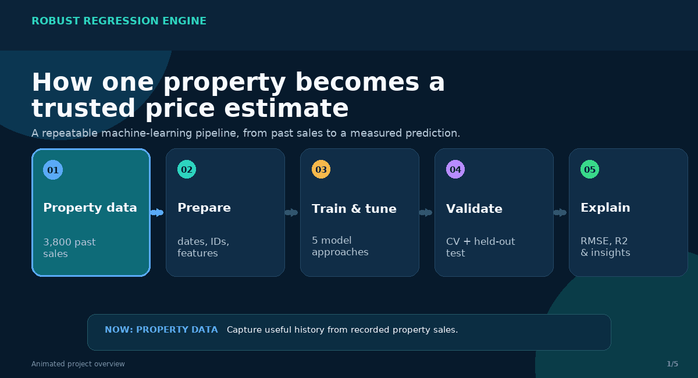
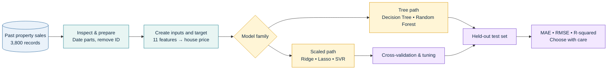
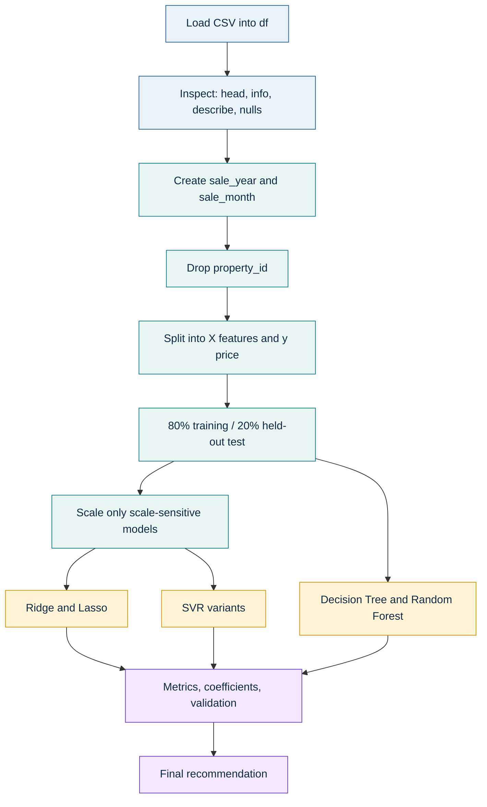
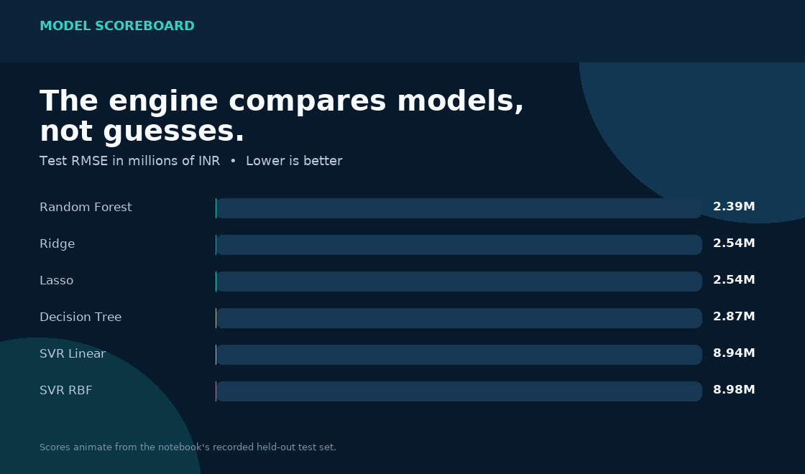
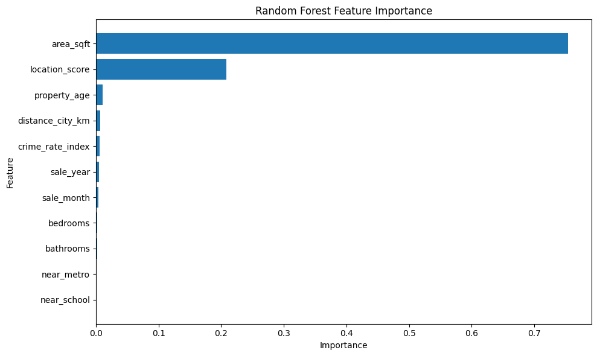
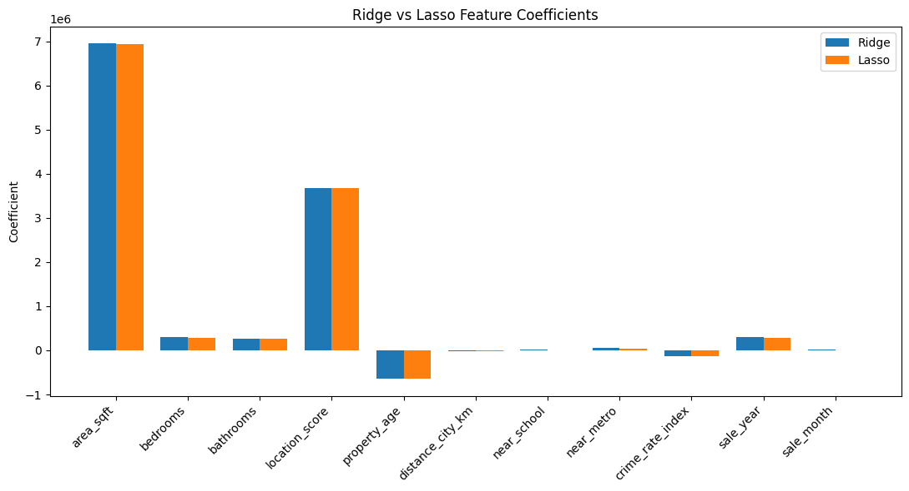
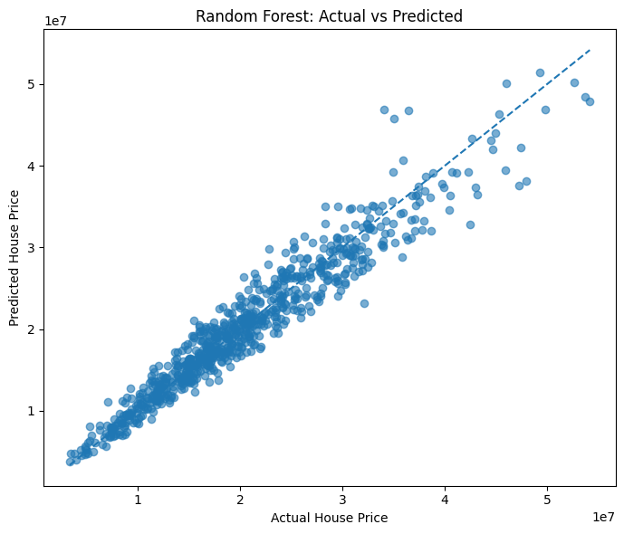
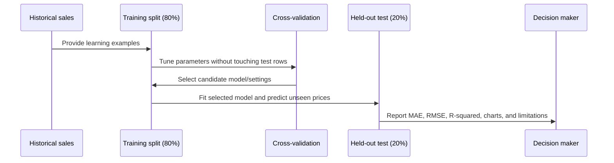
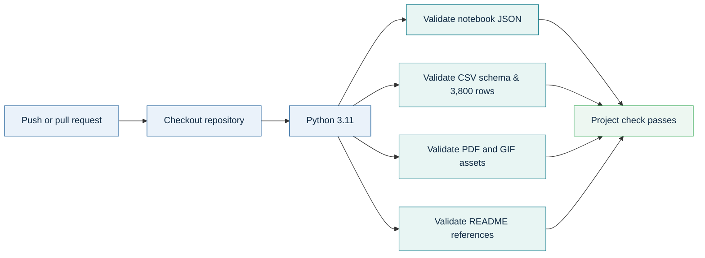

<div align="center">

# Robust Regression Engine

### A visual, explainable house-price prediction lab built with classic machine-learning models

<p>
  <a href="./Robust_Reression_Engine.ipynb"></a>
  <a href="https://colab.research.google.com/github/DevanshiCodesAI/Robust-Regression-Engine/blob/main/Robust_Reression_Engine.ipynb"></a>
  <a href="./Robust_Regression_Theory_Guide.pdf"></a>
  <a href="https://drive.google.com/file/d/1NDfC25Zm8Z2kJ2hLFD7XL7vyTIcoEB9m/view?usp=sharing">
    
</p>

<p>
  
  
  
  <a href="./.github/workflows/project-checks.yml"></a>
</p>

> **One question, five approaches:** given a home's known details, which model creates the most reliable price estimate on unseen sales?

</div>

---

## Jump in

<div align="center">

[](#quick-start) &nbsp;
[](#the-ml-pipeline) &nbsp;
[](#recorded-results) &nbsp;
[](./Robust_Regression_Theory_Guide.pdf)

</div>

## Why this project?

A price estimate is useful only when it is **checked**, **explainable**, and **honest about error**. This project compares regularised linear models, decision trees, an ensemble forest, and Support Vector Regression (SVR) on the same house-sale data.

| What the engine does | Why it matters |
|---|---|
| **Predicts a number** | The target is `house_price_inr`, so this is a regression task—not a yes/no classifier. |
| **Keeps a final test set aside** | A model is judged on 760 sales it did not use to learn, not on its own homework. |
| **Tunes instead of guessing** | Cross-validation selects settings such as regularisation strength (`alpha`) and SVR controls. |
| **Compares several model families** | A complicated model is not assumed to be better; the results decide. |
| **Explains the trade-offs** | Accuracy, stability, interpretability, and responsible use are considered together. |

---

## The ML pipeline

<p align="center">
  
</p>



<details>
<summary><b>Open the pipeline walkthrough</b></summary>

<br>

1. **Inspect the CSV** — check data types, ranges, and missing values before training anything.
2. **Prepare meaningful inputs** — convert `sale_date` into `sale_year` and `sale_month`; remove `property_id`, which is only a label.
3. **Split fairly** — use 80% of rows for training (3,040 sales) and reserve 20% (760 sales) for a final test.
4. **Scale only where it helps** — `StandardScaler` is used for Ridge, Lasso, and SVR. Tree models split at thresholds, so their decisions are not sensitive to raw scale.
5. **Train, validate, and compare** — tune settings with cross-validation, then compare every fitted model on the same held-out rows.
6. **Explain the result** — read MAE, RMSE, R-squared, train/test gaps, and feature signals before making a choice.

</details>

---

## The data at a glance

| Input | Plain-language meaning | Type in the model |
|---|---|---|
| `area_sqft` | Property size | Numeric |
| `bedrooms`, `bathrooms` | Room counts | Numeric |
| `location_score` | Supplied 1–10 location rating | Numeric |
| `property_age` | Age in years | Numeric |
| `distance_city_km` | Distance from the city | Numeric |
| `near_school`, `near_metro` | Nearby amenity flags | Binary: 0 or 1 |
| `crime_rate_index` | Supplied local crime index | Numeric |
| `sale_year`, `sale_month` | Date clues extracted from `sale_date` | Numeric |
| `house_price_inr` | Recorded sale price | **Target** |

**Source snapshot:** 3,800 records · 12 source columns · no missing values in the recorded inspection · price range INR 1.51M–59.30M.

> `property_id` is deliberately removed: a row label should not become a shortcut for predicting a property's value.

---

## Notebook tour — what `Robust_Reression_Engine.ipynb` actually does

The notebook is the experiment engine behind this README. It has **77 cells** and is organised as a guided learning path: ideas first, then data work, then model experiments, then an evidence-based conclusion. It is designed to be run **from top to bottom** because later cells use objects created earlier.

| Notebook part | Cells | What happens | Why it matters |
|---|---:|---|---|
| **Introduction & theory** | 0–6 | Introduces regularisation, Ridge/Lasso, cross-validation, and scaling. | Explains the choices before any code is run. |
| **Data understanding** | 7–27 | Loads the CSV, inspects it, creates date features, removes the ID, splits data, and scales where needed. | Turns a raw spreadsheet into a fair modelling dataset. |
| **Regularised linear models** | 28–43 | Fits Ridge and Lasso, tunes `alpha`, compares errors, and inspects coefficients. | Shows how simpler, stable formulas compete with more flexible models. |
| **Cross-validation strategies** | 44–52 | Compares K-Fold, stratified K-Fold, LOOCV discussion, and Time Series Split. | Checks whether one lucky data split is driving the result. |
| **Tree-based models** | 53–60 | Fits a guarded Decision Tree and a 300-tree Random Forest; computes feature importance. | Captures non-linear patterns and compares one tree with an ensemble. |
| **Support Vector Regression** | 61–66 | Tests linear, polynomial, and RBF SVR; searches `C`, `gamma`, and `epsilon`. | Tests a different mathematical approach instead of assuming trees win. |
| **Evaluation & reporting** | 67–76 | Builds the final leaderboard, checks train/test gaps, and produces the saved charts. | Turns model output into conclusions a reader can challenge and understand. |

### The objects created as you run it

| Notebook object | Created from | Meaning in plain English |
|---|---|---|
| `df` | CSV file | The full table of past property-sale records. |
| `X` | Prepared `df` without price | The clues available to the model: size, rooms, score, date parts, and so on. |
| `y` | `house_price_inr` | The recorded answer the model tries to learn. |
| `X_train`, `y_train` | 80% split | The examples used to learn model patterns. |
| `X_test`, `y_test` | 20% split | The final held-back exam used only for evaluation. |
| `X_train_scaled` | `StandardScaler` | Comparable-scale inputs for Ridge, Lasso, and SVR. |
| `ridge_cv`, `lasso_cv` | Cross-validated model fitting | The tuned linear models, including their chosen `alpha`. |
| `tree`, `rf` | Tree model fitting | The Decision Tree and Random Forest estimators. |
| `results_df` | Collected metrics | The final model comparison table. |



<details>
<summary><b>Part A — concepts before code</b></summary>

<br>

The notebook begins by defining the important ideas:

- **Regularisation** discourages extreme coefficients so a formula does not memorise quirks in the training data.
- **Ridge (L2)** shrinks all coefficients, which is useful when inputs overlap.
- **Lasso (L1)** can shrink some coefficients exactly to zero, producing a simpler formula.
- **Cross-validation** rotates which data is used for practice evaluation instead of trusting one split.
- **Tree models** use thresholds and ordering, so they do not need feature scaling in the same way that coefficient- and distance-based methods do.

</details>

<details>
<summary><b>Part B — data preparation, line by line</b></summary>

<br>

1. `pd.read_csv(...)` reads the property-sales file into `df`.
2. `df.head()`, `df.info()`, `df.describe()`, and `df.isnull().sum()` check that the table looks valid before modelling.
3. `pd.to_datetime(...)` converts the text date into a usable date type.
4. `sale_year` and `sale_month` are extracted, then the original date column is removed.
5. `property_id` is removed because it is only a row identifier, not a property characteristic.
6. `X = df.drop('house_price_inr', axis=1)` collects the input clues; `y = df['house_price_inr']` isolates the price answer.
7. `train_test_split(..., test_size=0.2, random_state=42)` creates the repeatable 80/20 split.
8. `StandardScaler` is fitted only on training inputs and then applied to test inputs. This avoids test-data leakage.

</details>

<details>
<summary><b>Part C — how the notebook tunes Ridge and Lasso</b></summary>

<br>

The notebook tests `alpha` values from `0.0001` to `100,000` on a logarithmic scale. Alpha is the strength of the simplicity penalty:

- A very small alpha can create a fragile model that follows training noise.
- A very large alpha can flatten useful patterns and cause underfitting.
- `RidgeCV` and `LassoCV` use 5-fold cross-validation to choose the alpha that best balances fit and stability.

The recorded best settings are **Ridge alpha = 1.0** and **Lasso alpha = 15,199.11**. The difference in their numeric alpha values is normal: alpha depends on the model formulation, target scale, and input representation; it is not a universal quality score.

</details>

<details>
<summary><b>Part D — why four validation strategies appear</b></summary>

<br>

- **K-Fold:** random, repeated practice tests; each fold is held out once.
- **Stratified K-Fold:** keeps low, middle, and high price bands balanced in each fold. Because price is continuous, the notebook creates bins first with `pd.qcut`.
- **LOOCV:** uses one record at a time as validation. It would require 3,800 model fits here, so the notebook explains the cost rather than running the full score.
- **Time Series Split:** better reflects a future-looking estimate when sales are ordered by time. For a production-grade time split, records should be explicitly sorted by the original date before splitting.

</details>

<details>
<summary><b>Parts E–H — trees, SVR, metrics, and final reporting</b></summary>

<br>

The notebook limits the Decision Tree with `max_depth`, `min_samples_split`, and `min_samples_leaf` so it cannot grow without restraint. It then trains a **300-tree Random Forest**, which averages many trees to reduce the noise sensitivity of one tree.

For SVR, a Pipeline first standardises features and then evaluates linear, polynomial, and RBF kernels. `GridSearchCV` tests 27 RBF parameter combinations across 5 folds. The notebook finally calculates MAE, MSE, RMSE, and R-squared for every model, compares train and test errors, and renders the charts shown below.

</details>

> **How to run safely:** choose **Kernel → Restart Kernel and Run All Cells** in Jupyter. Running later cells by themselves can fail because variables such as `X_train`, `ridge_cv`, or `rf` are created by earlier cells.

---

## Model lab

| Model | What it learns | Why it is included |
|---|---|---|
| **Ridge Regression (L2)** | One weighted price formula with coefficient shrinkage | A stable linear benchmark when inputs overlap. |
| **Lasso Regression (L1)** | A weighted formula that can set some coefficients to zero | Adds simple feature selection. |
| **Decision Tree** | A chain of if/then property rules | Captures nonlinear patterns in an intuitive way. |
| **Random Forest** | The averaged opinion of many decision trees | Reduces a single tree's tendency to chase noise. |
| **SVR** | A best-fit corridor using linear, polynomial, or RBF kernels | Tests a different, scale-sensitive pattern-finding approach. |

<details>
<summary><b>Ridge vs Lasso in one minute</b></summary>

<br>

- **Ridge / L2** shrinks all coefficients toward zero but usually keeps every input.
- **Lasso / L1** can shrink a coefficient all the way to zero, removing that input from the fitted formula.
- In this recorded run, the tuned Lasso model sets `near_school` to zero. That does **not** mean a nearby school has no real-world value; it means the feature did not add enough information beyond the other supplied columns for this specific fitted formula.

</details>

---

## Recorded results

<p align="center">
  
</p>

All models below are evaluated on the same held-out test split. **Lower MAE/RMSE is better; higher R-squared is better.** `M` means million INR.

| Model | MAE | RMSE | R-squared | Reading the result |
|---|---:|---:|---:|---|
| 🥇 **Random Forest** | INR 1.743M | **INR 2.387M** | **0.9292** | Best recorded test score; captures nonlinear relationships well. |
| Ridge (tuned) | INR 1.945M | INR 2.540M | 0.9199 | Strong, stable, and easier to explain feature by feature. |
| Lasso (tuned) | INR 1.947M | INR 2.543M | 0.9197 | Nearly Ridge-level accuracy with a simpler fitted formula. |
| Decision Tree | INR 2.115M | INR 2.866M | 0.8980 | Useful nonlinear baseline, but weaker than its forest. |
| SVR Linear | INR 6.956M | INR 8.940M | 0.0077 | Poor fit in the recorded search. |
| SVR RBF (tuned) | INR 6.985M | INR 8.977M | -0.0006 | Worse than an average-price baseline on this test. |

### Read the score like a practitioner

| Signal | What the notebook shows | Takeaway |
|---|---|---|
| **Best test metric** | Random Forest has the lowest RMSE and highest R-squared. | It is the current accuracy benchmark. |
| **Train/test gap** | Forest: INR 1.344M train RMSE → INR 2.387M test RMSE. | Good test score, but some overfitting is visible. |
| **Stable linear baseline** | Ridge and Lasso have test RMSE only ~INR 0.06M above train RMSE. | Their generalisation is very steady. |
| **SVR diagnostic** | Both train and test errors are high. | The current SVR representation/settings underfit this problem. |

> **Best score is not the only decision rule.** If explanation, auditability, or long-term stability matters most, Ridge or Lasso can be valuable reference models alongside the Random Forest.

---

## Chart gallery — directly from the notebook

These charts are extracted from the saved outputs in `Robust_Reression_Engine.ipynb`.

### 1) What did the Random Forest rely on most?

<p align="center">
  <a href="./assets/notebook_feature_importance.png"></a>
</p>

The model relies overwhelmingly on **`area_sqft`** (importance **0.7537**) and then **`location_score`** (**0.2082**). The remaining features are much smaller in this fitted forest.

**Use this chart carefully:** feature importance means the forest used a column to reduce prediction error. It does **not** prove the column causes a price change, does not show whether the effect is positive or negative, and can be shared between related variables such as size, bedrooms, and bathrooms.

<details>
<summary><b>How the notebook creates this chart</b></summary>

<br>

The `RandomForestRegressor` exposes `rf.feature_importances_`. The notebook pairs those values with `X.columns`, sorts the rows from largest to smallest, and draws a horizontal bar chart. The importance values across all features add up to 1.

</details>

### 2) How do Ridge and Lasso treat features differently?

<p align="center">
  <a href="./assets/notebook_ridge_lasso_coefficients.png"></a>
</p>

Both methods assign the strongest positive weight to **area** and **location score**, and both show a negative association for **property age** in this dataset. The key visual difference is subtle but important: the selected Lasso fit drives the `near_school` coefficient to exactly zero, whereas Ridge keeps every supplied coefficient in the formula.

Because the linear-model features are standardised, the bars are best read as the model's estimated contribution for a typical one-spread increase in a feature, holding the other supplied inputs fixed. They are **not** a statement that a homeowner can independently change one bar and guarantee a price movement.

### 3) Are actual and predicted prices close together?

<p align="center">
  <a href="./assets/notebook_actual_vs_predicted.png"></a>
</p>

Each dot is one test-set property. The horizontal position is the recorded price; the vertical position is the Random Forest estimate. The dashed diagonal represents a perfect prediction. Dots close to that diagonal are good estimates; larger vertical distances are larger misses.

The scatter pattern supports the strong Random Forest test score, while also making a crucial point: even the best model has spread around the ideal line. A production application should present a plausible range and explanation, not only a single price number.

---

## Metrics deep dive — what the notebook measures

| Metric | Plain-language question | Formula idea | Best direction | Why it appears in the notebook |
|---|---|---|---|---|
| **MAE** | “How much is a typical miss?” | Average of absolute errors | Lower | Easy to communicate because it is in INR. |
| **MSE** | “How strongly should big misses count?” | Average of squared errors | Lower | Gives larger mistakes extra weight during comparison. |
| **RMSE** | “What is a typical miss when large misses matter more?” | Square root of MSE | Lower | Returns to INR and is useful for model ranking. |
| **R-squared** | “How much better is this than always guessing the average?” | 1 − model error / baseline error | Higher | Shows improvement versus a simple average-price baseline. |

### A worked reading of the best result

- **Random Forest MAE = INR 1.743M:** the average absolute miss on the held-out test rows is approximately INR 1.743M.
- **Random Forest RMSE = INR 2.387M:** the error measure becomes larger than MAE when a few expensive misses exist, because it gives those misses extra weight.
- **Random Forest R-squared = 0.9292:** relative to an average-price-only baseline, the model captures about 93% of the variation in this test set. It does **not** mean “93% of individual predictions are correct.”
- **Negative R-squared for tuned RBF SVR:** on this test set, that particular configuration did worse than the average-price baseline.

<details>
<summary><b>Why include both MAE and RMSE?</b></summary>

<br>

MAE treats every rupee of error in a straight-line way. RMSE squares errors first, so a large miss hurts more than several small misses. In house-price tasks, both are useful: MAE gives an easy-to-explain average error; RMSE warns when the model occasionally makes particularly large mistakes.

</details>

---

## Reproducibility and experiment rules

The notebook follows several good experimental habits. They are worth preserving when extending the project.

1. **Fixed randomness:** `random_state=42` makes the train/test split and model randomness reproducible.
2. **Hold the test set back:** use the test rows only after choosing the model and settings. Do not repeatedly tune against the final test score.
3. **Fit scalers on training data only:** learning the test-set average or spread before prediction is information leakage.
4. **Put scaling inside validation Pipelines:** in cross-validation, each training fold learns its own scaler before evaluating its paired validation fold.
5. **Compare like with like:** every model in the final leaderboard is scored on the same held-out examples.
6. **Document model limits:** a good metric is evidence, not a promise. Check data drift, local market changes, uncertainty, and fairness before real use.



---

## Validation and quality pipeline




This check is intentionally fast and dependency-free. It verifies that the files a visitor can open from this README are present and structurally valid; it does not claim to retrain the models in CI.

---

## Quick start

### 1) Clone and enter the project

```bash
git clone https://github.com/DevanshiCodesAI/Robust-Regression-Engine.git
cd Robust-Regression-Engine
```

### 2) Create an isolated Python environment

```bash
python -m venv .venv
# macOS / Linux
source .venv/bin/activate
# Windows PowerShell
# .venv\Scripts\Activate.ps1

pip install -r requirements.txt
```

### 3) Launch the interactive notebook

```bash
jupyter notebook Robust_Reression_Engine.ipynb
```

Run cells from top to bottom. The notebook loads the CSV from the repository root, creates the train/test split, fits the models, tunes selected settings, and prints the comparison metrics.

### 4) Regenerate the theory guide (optional)

```bash
python create_theory_pdf.py
```

The resulting [`Robust_Regression_Theory_Guide.pdf`](./Robust_Regression_Theory_Guide.pdf) explains each concept in everyday language, including metrics, regularisation, cross-validation, trees, and SVR.

---

## Project map

```text
.
├── Advanced_Regression_HousePrice_Dataset.csv  # 3,800 property-sale records
├── Robust_Reression_Engine.ipynb               # Core modelling notebook
├── Robust_Regression_Theory_Guide.pdf          # Plain-language theory companion
├── requirements.txt                            # Notebook + documentation dependencies
├── assets/
    ├── robust-regression-pipeline.gif          # Animated ML workflow
    └── model-comparison.gif                    # Animated result comparison
```

---

## Extend the engine — useful next experiments

The current notebook deliberately provides a clear baseline comparison. The following additions would make a future version more production-ready.

| Next experiment | How to approach it | Why it is useful |
|---|---|---|
| **Chronological evaluation** | Sort by original `sale_date`; train on earlier sales and reserve the newest period for final evaluation. | Better mirrors a real “estimate the next sale” scenario. |
| **Prediction intervals** | Estimate uncertainty through quantile models, conformal prediction, or model ensembles. | A range is more honest than a single figure for a high-value decision. |
| **Data quality rules** | Flag duplicates, impossible values, missing fields, and out-of-date local indicators. | A strong algorithm cannot repair unreliable inputs automatically. |
| **Richer local features** | Add verified neighbourhood, transit, market trend, condition, and renovation information. | Price depends on details beyond the current table. |
| **Explain a single estimate** | Add a local explanation method and show similar historical examples. | Helps a user understand why one property received its estimate. |
| **Monitor after release** | Compare predictions with later sale prices and watch errors by time, price band, and area. | Models can drift when the market changes. |

### Questions to ask before trusting a new model version

- Are all input fields available **before** the prediction is made?
- Did the newest, truly unseen sales perform as well as the historical test set?
- Does error become worse for a particular price range, location, or property type?
- Is the expected error acceptable for the decision being supported?
- Can a reviewer explain the estimate and challenge it when needed?
- Does a human have the authority to override an implausible result?

---

## FAQ

<details>
<summary><b>Why is Random Forest the winner if Ridge and Lasso are also strong?</b></summary>

<br>

Random Forest has the lowest reported test RMSE and highest reported R-squared, so it is the accuracy leader in this recorded run. Ridge and Lasso remain valuable because their formulas are simpler to inspect and their train/test errors are closer together. The right choice depends on the balance between accuracy, explanation, speed, and governance requirements.

</details>

<details>
<summary><b>Can I say that the model is 93% accurate?</b></summary>

<br>

No. `R-squared = 0.9292` compares the model with an average-price baseline; it is not a percentage of individual homes predicted correctly. Use MAE and RMSE to discuss the size of price misses, and show a range for individual estimates.

</details>

<details>
<summary><b>Why did SVR perform so poorly?</b></summary>

<br>

The recorded SVR settings and feature representation did not match this problem well. SVR is scale-sensitive, and its controls must be selected in a way that makes sense for an INR-valued target. Poor results here do not mean SVR is always unsuitable; they mean it should not be deployed from this notebook without a justified redesign and another validation cycle.

</details>

<details>
<summary><b>Does high feature importance prove that area causes price?</b></summary>

<br>

No. It says the fitted Random Forest often used area to reduce prediction error in this data. It does not prove a causal relationship, and related inputs can share or trade importance. A causal question needs a different study design and domain expertise.

</details>

<details>
<summary><b>Why are tree models not scaled?</b></summary>

<br>

A tree asks threshold questions such as “is area below 1,800 sq ft?” Scaling changes the number written at the threshold but does not change which homes fall above or below it. Ridge, Lasso, and SVR are more sensitive to feature magnitude, so they use `StandardScaler`.

</details>

---

## Responsible use

This is a learning and comparison project, not a property valuation guarantee.

- A model finds patterns in recorded data; it does **not** prove cause and effect.
- An average error is not an error guarantee for one particular home.
- A real-world release should use a **chronological holdout** (train on earlier sales, test on later sales), track data changes, test fairness, and communicate an uncertainty range.
- Location-linked variables can reflect historical inequalities. Keep a human in the decision loop.

<div align="center">

### Make every prediction explainable, validated, and human-reviewed.

[](./Robust_Reression_Engine.ipynb)
[](./Robust_Regression_Theory_Guide.pdf)

</div>
