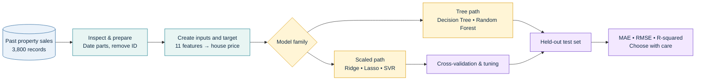
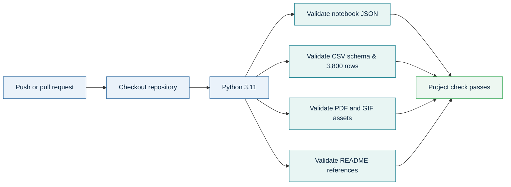

<div align="center">

# Robust Regression Engine

### A visual, explainable house-price prediction lab built with classic machine-learning models

<p>
  <a href="./Robust_Reression_Engine.ipynb"></a>
  <a href="https://colab.research.google.com/github/DevanshiCodesAI/Robust-Regression-Engine/blob/main/Robust_Reression_Engine.ipynb"></a>
  <a href="./Robust_Regression_Theory_Guide.pdf"></a>
</p>

<p>
  
  
  
  <a href="./.github/workflows/project-checks.yml"></a>
</p>

> **One question, five approaches:** given a home's known details, which model creates the most reliable price estimate on unseen sales?

</div>

---

## Jump in

<div align="center">

[](#quick-start) &nbsp;
[](#the-ml-pipeline) &nbsp;
[](#recorded-results) &nbsp;
[](./Robust_Regression_Theory_Guide.pdf)

</div>

## Why this project?

A price estimate is useful only when it is **checked**, **explainable**, and **honest about error**. This project compares regularised linear models, decision trees, an ensemble forest, and Support Vector Regression (SVR) on the same house-sale data.

| What the engine does | Why it matters |
|---|---|
| **Predicts a number** | The target is `house_price_inr`, so this is a regression task—not a yes/no classifier. |
| **Keeps a final test set aside** | A model is judged on 760 sales it did not use to learn, not on its own homework. |
| **Tunes instead of guessing** | Cross-validation selects settings such as regularisation strength (`alpha`) and SVR controls. |
| **Compares several model families** | A complicated model is not assumed to be better; the results decide. |
| **Explains the trade-offs** | Accuracy, stability, interpretability, and responsible use are considered together. |

---

## The ML pipeline

<p align="center">
  
</p>



<details>
<summary><b>Open the pipeline walkthrough</b></summary>

<br>

1. **Inspect the CSV** — check data types, ranges, and missing values before training anything.
2. **Prepare meaningful inputs** — convert `sale_date` into `sale_year` and `sale_month`; remove `property_id`, which is only a label.
3. **Split fairly** — use 80% of rows for training (3,040 sales) and reserve 20% (760 sales) for a final test.
4. **Scale only where it helps** — `StandardScaler` is used for Ridge, Lasso, and SVR. Tree models split at thresholds, so their decisions are not sensitive to raw scale.
5. **Train, validate, and compare** — tune settings with cross-validation, then compare every fitted model on the same held-out rows.
6. **Explain the result** — read MAE, RMSE, R-squared, train/test gaps, and feature signals before making a choice.

</details>

---

## The data at a glance

| Input | Plain-language meaning | Type in the model |
|---|---|---|
| `area_sqft` | Property size | Numeric |
| `bedrooms`, `bathrooms` | Room counts | Numeric |
| `location_score` | Supplied 1–10 location rating | Numeric |
| `property_age` | Age in years | Numeric |
| `distance_city_km` | Distance from the city | Numeric |
| `near_school`, `near_metro` | Nearby amenity flags | Binary: 0 or 1 |
| `crime_rate_index` | Supplied local crime index | Numeric |
| `sale_year`, `sale_month` | Date clues extracted from `sale_date` | Numeric |
| `house_price_inr` | Recorded sale price | **Target** |

**Source snapshot:** 3,800 records · 12 source columns · no missing values in the recorded inspection · price range INR 1.51M–59.30M.

> `property_id` is deliberately removed: a row label should not become a shortcut for predicting a property's value.

---

## Model lab

| Model | What it learns | Why it is included |
|---|---|---|
| **Ridge Regression (L2)** | One weighted price formula with coefficient shrinkage | A stable linear benchmark when inputs overlap. |
| **Lasso Regression (L1)** | A weighted formula that can set some coefficients to zero | Adds simple feature selection. |
| **Decision Tree** | A chain of if/then property rules | Captures nonlinear patterns in an intuitive way. |
| **Random Forest** | The averaged opinion of many decision trees | Reduces a single tree's tendency to chase noise. |
| **SVR** | A best-fit corridor using linear, polynomial, or RBF kernels | Tests a different, scale-sensitive pattern-finding approach. |

<details>
<summary><b>Ridge vs Lasso in one minute</b></summary>

<br>

- **Ridge / L2** shrinks all coefficients toward zero but usually keeps every input.
- **Lasso / L1** can shrink a coefficient all the way to zero, removing that input from the fitted formula.
- In this recorded run, the tuned Lasso model sets `near_school` to zero. That does **not** mean a nearby school has no real-world value; it means the feature did not add enough information beyond the other supplied columns for this specific fitted formula.

</details>

---

## Recorded results

<p align="center">
  
</p>

All models below are evaluated on the same held-out test split. **Lower MAE/RMSE is better; higher R-squared is better.** `M` means million INR.

| Model | MAE | RMSE | R-squared | Reading the result |
|---|---:|---:|---:|---|
| 🥇 **Random Forest** | INR 1.743M | **INR 2.387M** | **0.9292** | Best recorded test score; captures nonlinear relationships well. |
| Ridge (tuned) | INR 1.945M | INR 2.540M | 0.9199 | Strong, stable, and easier to explain feature by feature. |
| Lasso (tuned) | INR 1.947M | INR 2.543M | 0.9197 | Nearly Ridge-level accuracy with a simpler fitted formula. |
| Decision Tree | INR 2.115M | INR 2.866M | 0.8980 | Useful nonlinear baseline, but weaker than its forest. |
| SVR Linear | INR 6.956M | INR 8.940M | 0.0077 | Poor fit in the recorded search. |
| SVR RBF (tuned) | INR 6.985M | INR 8.977M | -0.0006 | Worse than an average-price baseline on this test. |

### Read the score like a practitioner

| Signal | What the notebook shows | Takeaway |
|---|---|---|
| **Best test metric** | Random Forest has the lowest RMSE and highest R-squared. | It is the current accuracy benchmark. |
| **Train/test gap** | Forest: INR 1.344M train RMSE → INR 2.387M test RMSE. | Good test score, but some overfitting is visible. |
| **Stable linear baseline** | Ridge and Lasso have test RMSE only ~INR 0.06M above train RMSE. | Their generalisation is very steady. |
| **SVR diagnostic** | Both train and test errors are high. | The current SVR representation/settings underfit this problem. |

> **Best score is not the only decision rule.** If explanation, auditability, or long-term stability matters most, Ridge or Lasso can be valuable reference models alongside the Random Forest.

---

## Validation and quality pipeline

The repository includes a lightweight GitHub Actions workflow at [`.github/workflows/project-checks.yml`](./.github/workflows/project-checks.yml). It runs on pushes, pull requests, and manual dispatches.



This check is intentionally fast and dependency-free. It verifies that the files a visitor can open from this README are present and structurally valid; it does not claim to retrain the models in CI.

---

## Quick start

### 1) Clone and enter the project

```bash
git clone https://github.com/DevanshiCodesAI/Robust-Regression-Engine.git
cd Robust-Regression-Engine
```

### 2) Create an isolated Python environment

```bash
python -m venv .venv
# macOS / Linux
source .venv/bin/activate
# Windows PowerShell
# .venv\Scripts\Activate.ps1

pip install -r requirements.txt
```

### 3) Launch the interactive notebook

```bash
jupyter notebook Robust_Reression_Engine.ipynb
```

Run cells from top to bottom. The notebook loads the CSV from the repository root, creates the train/test split, fits the models, tunes selected settings, and prints the comparison metrics.

### 4) Regenerate the theory guide (optional)

```bash
python create_theory_pdf.py
```

The resulting [`Robust_Regression_Theory_Guide.pdf`](./Robust_Regression_Theory_Guide.pdf) explains each concept in everyday language, including metrics, regularisation, cross-validation, trees, and SVR.

---

## Project map

```text
.
├── Advanced_Regression_HousePrice_Dataset.csv  # 3,800 property-sale records
├── Robust_Reression_Engine.ipynb               # Core modelling notebook
├── Robust_Regression_Theory_Guide.pdf          # Plain-language theory companion
├── create_theory_pdf.py                        # Rebuilds the PDF guide
├── requirements.txt                            # Notebook + documentation dependencies
├── assets/
│   ├── robust-regression-pipeline.gif          # Animated ML workflow
│   └── model-comparison.gif                    # Animated result comparison
├── scripts/
│   ├── create_readme_gifs.py                   # Rebuilds README GIFs
│   └── verify_project.py                       # Fast integrity checks
└── .github/workflows/project-checks.yml        # GitHub Actions workflow
```

---

## Responsible use

This is a learning and comparison project, not a property valuation guarantee.

- A model finds patterns in recorded data; it does **not** prove cause and effect.
- An average error is not an error guarantee for one particular home.
- A real-world release should use a **chronological holdout** (train on earlier sales, test on later sales), track data changes, test fairness, and communicate an uncertainty range.
- Location-linked variables can reflect historical inequalities. Keep a human in the decision loop.

<div align="center">

### Make every prediction explainable, validated, and human-reviewed.

[](./Robust_Reression_Engine.ipynb)
[](./Robust_Regression_Theory_Guide.pdf)

</div>
